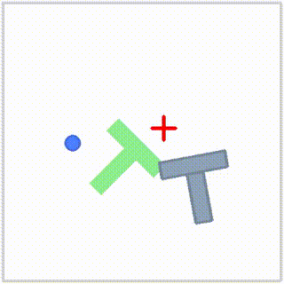
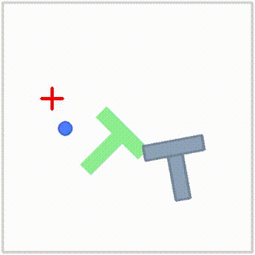
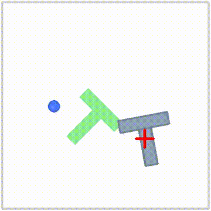

# dp-act-policy-study

Diffusion Policy (Chi et al., 2023) 및 ACT (Zhao et al., 2023) 논문 분석과 LeRobot 기반 구현 실험 기록

**결과 요약:** Push-T의 50-episode 평가에서 Diffusion Policy는 **24%**, 기본 ACT는 **2%**, temporal ensembling을 끄고 chunk를 길게 실행한 ACT는 **12%** 성공률을 기록했다. 이 조건에서 ACT의 주요 병목은 학습 손실보다 temporal ensembling을 포함한 실행 전략으로 나타났다.

## 📄 논문 정보

### Diffusion Policy
- **논문**: Diffusion Policy: Visuomotor Policy Learning via Action Diffusion
- **저자**: Cheng Chi et al. (Columbia University)
- **링크**: https://arxiv.org/abs/2303.04137

### ACT (Action Chunking with Transformers)
- **논문**: Learning Fine-Grained Bimanual Manipulation with Low-Cost Hardware
- **저자**: Tony Z. Zhao et al.
- **링크**: https://arxiv.org/abs/2304.13705

**프레임워크**: [LeRobot](https://github.com/huggingface/lerobot) (HuggingFace)

---

## 🧠 핵심 아이디어

### 공통점 — Action Chunking
두 알고리즘 모두 매 스텝 action 하나씩 예측하는 대신, 여러 스텝(chunk)을 한 번에 예측한다. Policy가 실제로 내리는 독립적인 결정 횟수를 줄여 compounding error를 완화하는 것이 핵심 동기.

기존 방법들의 한계:
| 방법 | 문제점 |
|------|--------|
| Explicit Policy (LSTM-GMM) | multimodal action distribution 표현 불가 → 평균값 출력 |
| Implicit Policy (IBC) | 학습 불안정성 (negative sampling 문제) |

### Diffusion Policy 해결책
- 노이즈에서 시작해 K번 반복적으로 gradient 방향으로 이동하며 action 생성
- Stochastic Langevin Dynamics → multimodal 표현 가능
- 에너지 gradient만 학습 → 정규화 상수 Z 불필요 → 학습 안정성 확보

### ACT 해결책
- CVAE로 human demonstration의 multimodality를 latent z로 인코딩
- Transformer encoder(BERT식 [CLS] 토큰)로 z 추론, decoder(cross-attention)로 action chunk 생성
- **Temporal Ensembling**: 매 스텝 재쿼리하며 겹치는 chunk 예측들을 지수가중평균으로 결합

---

## ⚖️ DP vs ACT 방식 비교

| | Diffusion Policy | ACT |
|---|---|---|
| 생성 모델 | Diffusion (DDPM) | CVAE |
| `n_obs_steps` | 2 (기본값) | **1로 강제** (코드 레벨 validation) |
| Velocity 정보 | 프레임 차분으로 암묵적 추론 가능 | 원천 차단 (단일 시점만 관측) |
| 실행 전략 | Partial execution (n_action_steps개 실행 후 버림) | Temporal ensembling (매 스텝 재쿼리 후 가중평균) |
| 재쿼리 시 처리 | 예전 예측 버리고 완전 교체("덮어쓰기") | 예전·새 예측을 가중평균("섞기") |
| 파라미터 수 (Push-T) | 52M (ResNet18 포함) | 40M (state 기반, ResNet 제외) |
| 학습 속도 (Push-T) | 6.28 step/s | 10.6~27.5 step/s (batch에 따라 다름) |

---

## 🔬 실험 환경
- **OS**: Ubuntu 22.04
- **GPU**: RTX 4060 8GB
- **Framework**: LeRobot 0.6.1
- **Task**: Push-T (2D manipulation)

---

## 📊 Diffusion Policy 실험 결과

### Push-T Task - Steps별 성능 비교
**Dataset**: lerobot/pusht (206 episodes, 25,650 frames)

| Steps | Success Rate | 특징 |
|-------|-------------|------|
| 10k | ~0% | 방향성 없음, 완전 실패 |
| 20k | 5~10% | 접근 시도, 정밀도 부족 |
| 40k | 15~20% | 목표 근처 도달 |
| 100k | **24%** | 로그 수치 확인 |

> 논문 기준 success rate: **95%** (batch size 256, 고사양 환경)

### 성능 차이 원인 분석
- **batch size**: 8 (본 실험) vs 256 (논문) — RTX 4060 8GB VRAM 한계
- 동일 조건 재현의 어려움 확인

---

## 📊 Push-T 최종 비교 요약

**평가 기준**: `eval.n_episodes=50`, Push-T 성공률(`pc_success`) 기준. ACT keypoints 계열은 `lerobot/pusht_keypoints` + `env.obs_type=environment_state_agent_pos`를 사용했다.

| 구분 | 입력 | 핵심 실행 방식 | 최종 Success Rate | 해석 |
|------|------|----------------|------------------|------|
| Diffusion Policy | image + agent pos | diffusion sampling + partial execution | **24%** | 현재 실험 기준 최고 성능. Multimodal action을 평균으로 뭉개지 않고 샘플링으로 표현하는 장점이 Push-T에 잘 맞음 |
| ACT noensemble | keypoints + agent pos | temporal ensemble OFF, `n_action_steps=32` | **12%** | ACT 중 최고. 겹치는 chunk 평균을 제거하자 성공률과 reward가 크게 상승 |
| ACT 기본 계열(v2) | keypoints + agent pos | temporal ensemble ON, `n_action_steps=1` | **2%** | batch/lr을 레퍼런스에 맞춰도 낮음. 실행 전략 병목 가능성이 큼 |
| ACT pixel | image + agent pos | temporal ensemble ON, `n_action_steps=1` | **2%** | 입력을 이미지로 바꿔도 성공률이 동일하게 낮음 |
| ACT maxbatch | keypoints + agent pos | batch/lr 증가, temporal ensemble ON | **0%** | train loss는 가장 낮지만 closed-loop 성공률은 개선되지 않음 |
| ACT klweight1 | keypoints + agent pos | `kl_weight=1`, temporal ensemble ON | **0%** | KL weight만 낮추는 것은 병목 해결에 실패 |

### 100K Rollout GIF 비교

<table>
  <tr>
    <th>Diffusion Policy 100K</th>
    <th>ACT 기본(v2) 100K</th>
    <th>ACT noensemble 100K</th>
  </tr>
  <tr>
    <td></td>
    <td></td>
    <td></td>
  </tr>
  <tr>
    <td>Success Rate 24%</td>
    <td>Success Rate 2%</td>
    <td>Success Rate 12%</td>
  </tr>
</table>

**초안 결론**: Push-T에서는 단순 supervised imitation loss를 더 잘 낮추는 것보다, rollout 중 action chunk를 어떻게 실행하느냐가 더 중요했다. 특히 ACT의 temporal ensembling은 서로 다른 action mode를 평균내는 구조라, 접촉 방향이 갈리는 Push-T에서 성능을 크게 제한한 것으로 보인다.

---

## 📊 ACT 실험 결과

### 실험 1 — `lerobot/pusht` (이미지 기반)

**설정**:
```
--dataset.repo_id=lerobot/pusht
--policy.chunk_size=64
--policy.n_action_steps=1
--policy.temporal_ensemble_coeff=0.01
--batch_size=8
--policy.optimizer_lr=1e-5 (default)
--env.type=pusht (기본값, 이미지 기반 관측)
```

**결과**: `pc_success=2.0%`, `avg_sum_reward=25.19`, `avg_max_reward=0.355`, `num_params=52M`, `22.44 step/s`

### 실험 2 — `lerobot/pusht_keypoints`, batch=8 (⚠️ Inconclusive)

**설정**: 실험 1과 동일 batch_size=8을 관성적으로 유지, `--env.obs_type=environment_state_agent_pos` 추가

**결과**: 최종 `pc_success=0.0%`, `avg_sum_reward=16.31`, `avg_max_reward=0.174`, peak success `2.0%` at 50k, `num_params=40M`, `27.55 step/s`

**Inconclusive 판정 사유**: 이미지 인코더(ResNet18)가 빠져 VRAM 제약이 사실상 사라졌음에도 batch_size=8을 그대로 사용. LeRobot 공식 GitHub PR([#314](https://github.com/huggingface/lerobot/pull/314))에서 동일 데이터셋으로 `batch_size=64`, `lr=3e-5` 설정 시 **~50% success**를 보고한 것과 비교하면, 이 실험은 batch/lr이 confound로 작용해 "이미지 병목 vs velocity 병목" 원 가설을 검증하지 못함.

### 실험 3 (v2) — `lerobot/pusht_keypoints`, batch=64, lr=3e-5 (레퍼런스 재현)

**설정**: 실험 2에서 `--batch_size=64 --policy.optimizer_lr=3e-5`로 수정, PR #314 설정과 일치

**결과**: `pc_success=2.0%`, `avg_max_reward=0.328`, `10.83 step/s`, 총 학습시간 2h33m50s

**의의**: batch/lr을 레퍼런스와 정확히 맞췄음에도 여전히 2% — batch/lr이 주 원인이 아님을 강하게 시사.

### 실험 4 (maxbatch) — batch=128, lr=6e-5

**설정**: 실험 3에서 `--batch_size=128 --policy.optimizer_lr=6e-5`로 증가(linear scaling)

**결과**: 최종 `pc_success=0.0%`, `avg_sum_reward=24.77`, `avg_max_reward=0.373`, peak success `2.0%` at 30k, 최종 train loss `0.068`

**의의**: train loss는 ACT 실험 중 가장 낮았지만 성공률은 오히려 0%. Push-T에서 open-loop imitation loss와 closed-loop task success가 강하게 어긋날 수 있음을 확인.

### 실험 5 (noensemble) — temporal ensemble OFF, `n_action_steps=32`

**설정**: 실험 3과 같은 `batch_size=64`, `lr=3e-5`, `kl_weight=10`을 유지하고 `--policy.temporal_ensemble_coeff=null`, `--policy.n_action_steps=32`로 변경

**결과**: 최종 `pc_success=12.0%`, `avg_sum_reward=69.96`, `avg_max_reward=0.595`, peak success `12.0%` at 100k, peak `avg_max_reward=0.767` at 90k

**의의**: ACT 실험 중 최고 성능. temporal ensembling을 끄고 하나의 chunk를 더 길게 실행하자 reward와 성공률이 모두 상승했다. 즉 입력 모달리티나 batch보다 실행 전략이 더 큰 병목임을 강하게 지지.

### 실험 6 (klweight1) — `kl_weight=1`

**설정**: 실험 3과 같은 `batch_size=64`, `lr=3e-5`, temporal ensemble ON 조건에서 `kl_weight=10`을 `1`로 낮춤

**결과**: 최종 재평가 기준 `pc_success=0.0%`, `avg_sum_reward=24.85`, `avg_max_reward=0.280`

**주의**: `logs/act_pusht_keypoints_100k_klweight1_train_log.txt`에는 shell redirection 에러만 남아 있어 checkpoint별 eval curve는 복원되지 않음. 최종 결과는 별도 eval 결과(`lerobot/outputs/eval/2026-07-10/09-03-05_pusht_act/eval_info.json`) 기준.

### ACT Ablation 요약표

| 실험 | Dataset/Input | Batch | LR | `kl_weight` | Temporal Ensemble | `n_action_steps` | 최종 SR | Peak SR | 최종 avg_sum | 최종 avg_max | 핵심 해석 |
|------|---------------|------:|---:|------------:|-------------------|-----------------:|--------:|--------:|-------------:|-------------:|-----------|
| pixel | `pusht` image | 8 | 1e-5 | 10 | ON (`0.01`) | 1 | 2% | 2% | 25.19 | 0.355 | 이미지 입력이어도 기본 ACT 실행 방식에서는 낮음 |
| batch8 keypoints | `pusht_keypoints` state | 8 | 1e-5 | 10 | ON (`0.01`) | 1 | 0% | 2% | 16.31 | 0.174 | batch/lr confound가 있어 inconclusive |
| v2 | `pusht_keypoints` state | 64 | 3e-5 | 10 | ON (`0.01`) | 1 | 2% | 2% | 22.98 | 0.328 | 레퍼런스 batch/lr에도 낮음 |
| maxbatch | `pusht_keypoints` state | 128 | 6e-5 | 10 | ON (`0.01`) | 1 | 0% | 2% | 24.77 | 0.373 | loss 감소가 성공률로 이어지지 않음 |
| noensemble | `pusht_keypoints` state | 64 | 3e-5 | 10 | OFF | 32 | **12%** | **12%** | **69.96** | **0.595** | 평균화를 제거하자 ACT 최고 성능 |
| klweight1 | `pusht_keypoints` state | 64 | 3e-5 | 1 | ON (`0.01`) | 1 | 0% | - | 24.85 | 0.280 | KL만 낮춰서는 개선 없음 |

### 흥미로운 관찰

- **pixel ACT(2%)와 keypoints ACT v2(2%)가 서로 다른 입력 모달리티에도 동일한 성공률로 수렴.** 공통 변수는 `chunk_size=64`, `n_action_steps=1`, `temporal_ensemble_coeff=0.01` 조합.
- **maxbatch는 train loss가 가장 낮았지만 성공률 0%.** 모델이 demonstration action을 더 잘 맞추는 것과 closed-loop로 T블록을 성공시키는 것은 별개였다.
- **noensemble만 reward scale이 크게 상승.** temporal ensemble을 제거하자 평균 action이 줄고, 하나의 action mode를 더 일관되게 실행한 것으로 해석된다.
- **klweight1은 개선 없음.** posterior regularization 강도보다 rollout 실행 방식이 더 큰 병목으로 보인다.

---

## 🧩 ACT 성공률 분석 초안

### ACT 성공률이 낮은 이유

1. **Temporal Ensembling의 action mode 평균화**

   Push-T는 같은 상태에서도 "왼쪽으로 돌아 밀기", "오른쪽으로 돌아 밀기", "먼저 접근 후 회전시키기"처럼 여러 action mode가 존재한다. ACT가 매 스텝 chunk를 재예측하고 temporal ensemble로 겹치는 action들을 평균내면, 서로 다른 전략이 섞여 어느 방향도 제대로 밀지 못하는 action이 될 수 있다.

   **근거**: temporal ensemble ON 실험들은 입력, batch, lr, KL을 바꿔도 0~2%에 머물렀고, ensemble을 끈 noensemble만 12%까지 상승했다.

2. **단일 관측(`n_obs_steps=1`)으로 인한 velocity/momentum 정보 부재**

   `ACTConfig`는 `n_obs_steps=1`을 코드 레벨에서 강제한다. Push-T의 keypoints 관측은 `observation.state` shape `[2]`와 `observation.environment_state` shape `[16]`이며, 명시적인 velocity가 없다. 접촉 후 밀리는 방향과 momentum이 중요한 pushing task에서 단일 시점 관측은 불리하다.

   **근거**: Diffusion Policy는 기본적으로 `n_obs_steps=2`를 사용해 프레임 차분을 통해 속도 정보를 암묵적으로 볼 수 있다. 반면 ACT는 현재 위치만 보고 다음 chunk를 정해야 한다.

3. **Behavior Cloning 계열 objective와 closed-loop 성공률의 불일치**

   ACT는 demonstration action chunk를 reconstruction하는 방향으로 학습된다. 하지만 Push-T에서는 작은 action 오차가 접촉 상태를 바꾸고, 다음 상태 분포가 demonstration에서 벗어나기 쉽다.

   **근거**: maxbatch는 최종 train loss `0.068`로 가장 낮았지만 성공률은 0%였다. 즉 loss를 더 낮추는 것이 task success를 보장하지 않았다.

4. **ACT의 원래 설계 도메인과 Push-T의 불일치**

   ACT는 ALOHA류 고차원 joint state 기반 bimanual manipulation에서 강점을 보인 방법이다. 반면 Push-T는 2D 저차원 action, 접촉 역학, 목표 정렬이 핵심인 task라 단일 시점 BC chunk가 취약하다.

   **근거**: pixel 입력과 keypoints 입력을 바꿔도 기본 ACT 성공률이 2%로 비슷했고, 실행 방식 변경에서만 큰 차이가 났다.

5. **낮은 우선순위로 내려간 가설들**

   | 가설 | 실험 결과 | 현재 판단 |
   |------|-----------|-----------|
   | Batch size/LR 부족 | batch 64, lr 3e-5(v2)도 2%; batch 128, lr 6e-5(maxbatch)는 0% | 주 원인 아님 |
   | `kl_weight=10`이 너무 큼 | `kl_weight=1`로 낮춰도 0% | 단독 원인 아님 |
   | 이미지 인코더/입력 모달리티 문제 | pixel ACT와 keypoints ACT가 모두 2% 수준 | 주 원인 아님 |

### ACT 성공률이 상대적으로 높아진 이유

1. **Temporal ensemble 제거로 평균 action이 줄어듦**

   noensemble은 겹치는 chunk들을 매 스텝 평균내지 않고, 예측한 chunk 일부를 그대로 실행한다. 이 때문에 "왼쪽으로 밀기"와 "오른쪽으로 밀기"가 섞이는 현상이 줄고, 하나의 전략을 더 일관되게 밀고 갈 수 있다.

2. **`n_action_steps=32`로 chunk 실행의 일관성이 증가**

   기본 ACT 설정은 `n_action_steps=1`이라 매 스텝 새 chunk를 예측하고 이전 예측과 섞는다. noensemble은 32 step을 실행하므로 짧은 구간에서는 계획이 덜 흔들린다. Push-T처럼 접촉 후 일정 방향으로 계속 밀어야 하는 task에서는 이 점이 유리했다.

3. **성공률뿐 아니라 reward도 같이 상승**

   noensemble은 최종 `avg_sum_reward=69.96`, `avg_max_reward=0.595`로 v2(`22.98`, `0.328`)보다 훨씬 높다. 우연히 몇 episode만 성공한 것이 아니라, 전반적으로 목표 근처까지 더 잘 도달한 것으로 해석된다.

### 현재 초안 결론

Push-T에서 ACT가 낮은 성공률을 보인 핵심 원인은 `kl_weight`나 batch size보다 **temporal ensembling이 multimodal action을 평균내는 실행 방식**과 **단일 관측으로 접촉 동역학을 추정해야 하는 구조적 한계**에 있다. 반대로 ACT 성능을 올린 가장 큰 요인은 모델 크기나 loss 감소가 아니라, temporal ensemble을 끄고 chunk를 더 일관되게 실행한 것이다.

---

## 🗂️ 코드 구조
```
dp-act-policy-study/
├── README.md
├── lerobot/                         # LeRobot 소스 (submodule)
│   └── src/lerobot/
│       ├── policies/
│       │   ├── diffusion/
│       │   │   ├── modeling_diffusion.py
│       │   │   └── configuration_diffusion.py
│       │   └── act/
│       │       ├── modeling_act.py          # 분석 예정
│       │       └── configuration_act.py
│       └── scripts/
│           ├── lerobot_train.py
│           └── lerobot_eval.py
├── outputs/train/
│   ├── act_pusht_100k/                              # 실험 1
│   ├── act_pusht_keypoints_100k_batch8_inconclusive/ # 실험 2
│   ├── act_pusht_keypoints_100k_v2/                 # 실험 3
│   ├── act_pusht_keypoints_100k_maxbatch/           # 실험 4
│   ├── act_pusht_keypoints_100k_noensemble/         # 실험 5
│   └── act_pusht_keypoints_100k_klweight1/          # 실험 6
└── docs/
    └── code_analyze.md
```

---

## 🔍 논문-코드 매핑

### Diffusion Policy
| 논문 수식 | 코드 위치 | 설명 |
|----------|----------|------|
| Eq.1 (추론) | modeling_diffusion.py | K번 denoising 루프 |
| Eq.3 (학습) | modeling_diffusion.py | MSE loss |
| Eq.4 (조건화 추론) | modeling_diffusion.py | O_t 조건 추가 |
| Eq.5 (조건화 학습) | modeling_diffusion.py | conditional loss |

### ACT
| 개념 | 코드 위치 | 설명 |
|------|----------|------|
| Action Chunking | `configuration_act.py: chunk_size` | 한 번에 예측하는 action sequence 길이 |
| CVAE Encoder | `modeling_act.py` (vae_encoder) | [CLS]+robot_state+action(64개)=66 토큰 입력. environment_state(T블록 위치)는 encoder에 미입력 → z가 목표물 상태와 무관하게 결정됨 |
| Temporal Ensembling | `modeling_act.py: ACTTemporalEnsembler` | 지수가중평균 (m=0.01), n_action_steps=1 강제 |
| KL Loss | `configuration_act.py: kl_weight` | reconstruction + kl_weight × KL (`10.0` 기본, `1.0` ablation 수행) |

---

## ⚙️ 실행 방법

### 환경 세팅
```bash
git clone --recurse-submodules https://github.com/jack2148/dp-act-policy-study.git
cd dp-act-policy-study/lerobot
conda create -n lerobot python=3.10
conda activate lerobot
pip install -e .
pip install 'lerobot[dataset]'
pip install 'lerobot[training]'   # accelerate 등 학습 필수 의존성
pip install gym-pusht
```

### Diffusion Policy 학습
```bash
lerobot-train \
  --policy.type=diffusion \
  --env.type=pusht \
  --dataset.repo_id=lerobot/pusht \
  --policy.push_to_hub=false \
  --wandb.enable=false \
  --steps=100000
```

### ACT 학습 (keypoints, 레퍼런스 설정)
```bash
nohup lerobot-train \
  --policy.type=act \
  --dataset.repo_id=lerobot/pusht_keypoints \
  --output_dir=outputs/train/act_pusht_keypoints_100k_v2 \
  --job_name=act_pusht_keypoints_100k_v2 \
  --policy.device=cuda \
  --policy.chunk_size=64 \
  --policy.n_action_steps=1 \
  --policy.temporal_ensemble_coeff=0.01 \
  --policy.optimizer_lr=3e-5 \
  --policy.push_to_hub=false \
  --steps=100000 \
  --batch_size=64 \
  --env.type=pusht \
  --env.obs_type=environment_state_agent_pos \
  --eval_freq=10000 \
  --save_freq=10000 \
  --eval.n_episodes=50 \
  --wandb.enable=false \
  > logs/act_pusht_keypoints_100k_v2_train_log.txt 2>&1 &
disown
```

### 평가
```bash
lerobot-eval \
  --policy.path=outputs/train/[실험폴더]/checkpoints/last/pretrained_model \
  --env.type=pusht \
  --eval.n_episodes=50 \
  --device=cuda
```

---

## 🐛 트러블슈팅

### Diffusion Policy
| 문제 | 원인 | 해결 |
|------|------|------|
| pymunk 충돌 | 버전 7.3.0 호환 안됨 | 6.4.0 다운그레이드 |
| HuggingFace 401 | 인증 없음 | 로컬 저장으로 우회 |
| gym_pusht not found | 별도 패키지 | pip install gym-pusht |
| MUJOCO_PATH 미설정 | 환경변수 없음 | 수동 설정 |

### ACT
| 문제 | 원인 | 해결 |
|------|------|------|
| `'policy.repo_id' argument missing` | `push_to_hub` 기본값 `true` | `--policy.push_to_hub=false` 추가 |
| `FileExistsError: Output directory already exists` | `output_dir` 사전 생성 후 resume=false로 재실행 | 기존 폴더 `rm -rf` 후 재실행 |
| `KeyError: 'observation.environment_state'` | eval 시뮬레이터가 기본값(이미지 기반)으로 관측 생성, 데이터셋은 keypoints 기반 | `--env.obs_type=environment_state_agent_pos` 명시 |
| `unrecognized arguments: --optimizer_lr` | top-level이 아닌 policy config 하위 필드 | `--policy.optimizer_lr=` 로 접두사 수정 |
| `ImportError: 'accelerate' is required` | 최근 LeRobot 버전이 학습 시 필수 의존성으로 요구 | `pip install 'lerobot[training]'` |
| `n_action_steps` + `temporal_ensemble_coeff` 동시 사용 불가 | 코드 레벨 제약 (`n_action_steps>1`이면 앙상블할 겹치는 chunk가 안 생김) | 둘 중 하나만 선택: temporal ensembling(`n_action_steps=1`) 또는 partial execution(`n_action_steps>1`, coeff=None) |

---

## 📌 Push-T 실험 상태

- [x] Diffusion Policy 100k baseline 평가
- [x] ACT pixel baseline 평가
- [x] ACT keypoints batch/lr ablation 평가
- [x] ACT maxbatch 평가
- [x] ACT noensemble 실행 전략 ablation 평가
- [x] ACT `kl_weight=1` ablation 최종 checkpoint 재평가
- [x] Diffusion Policy vs ACT 정량 비교표 작성
- [x] Push-T 기준 ACT 성공률 원인 분석 초안 작성

Push-T에서는 여기까지를 1차 비교 실험으로 마무리한다. 현재 결론은 ACT가 Push-T에서 본질적으로 불가능하다는 뜻이 아니라, LeRobot 기본 ACT 설정의 `n_obs_steps=1`과 temporal ensembling 실행 방식이 이 task에 불리하게 작용했다는 쪽에 가깝다.

## 🔭 Future Work — 관측 차원과 알고리즘 적합성

**가설**: Push-T(2D, 저차원 관측)에서 관찰된 ACT의 저조한 성능은 알고리즘 자체의 열등함이라기보다, ACT가 원래 강점을 보인 도메인(ALOHA, 고차원 joint state)과 Push-T의 관측/동역학 특성이 맞지 않은 데서 크게 기인한다.

- 저차원 태스크(Push-T)일수록 단일 시점 정보가 부족해 시간축 정보(여러 프레임, DP의 `n_obs_steps=2`)에 대한 의존도가 커짐
- 고차원 태스크(ALOHA류)일수록 단일 시점 정보가 이미 풍부해 ACT의 단일 프레임 설계로도 충분히 버틸 수 있음

**다음 검증 후보**

- Velocity 정보 추가 실험: keypoints state에 finite difference velocity를 추가해 ACT의 단일 관측 병목을 직접 검증
- MuJoCo ALOHA sim 태스크: `transfer_cube`, `insertion` 등 joint state 기반 고차원 관측에서 동일한 DP vs ACT 비교 반복
- RBY-1 실제 데이터 적용 전 리허설: Push-T에서 얻은 "실행 전략/관측 차원" 교훈을 실제 로봇 데이터 설정에 반영

가설이 맞다면 Push-T에서의 격차(DP 24% vs 기본 ACT 2%, best ACT 12%)가 ALOHA sim에서는 좁혀지거나 역전될 것으로 예측한다.

---

## 📚 참고
- [Diffusion Policy Paper](https://arxiv.org/abs/2303.04137)
- [ACT Paper](https://arxiv.org/abs/2304.13705)
- [LeRobot](https://github.com/huggingface/lerobot)
- [공식 Diffusion Policy repo](https://github.com/real-stanford/diffusion_policy)
- [LeRobot PR #314 - ACT + environment_state 지원](https://github.com/huggingface/lerobot/pull/314)
