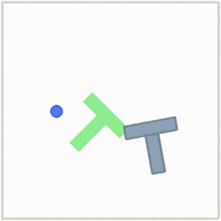
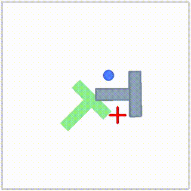

# Diffusion Policy Study

Diffusion Policy (Chi et al., 2023) 논문 분석 및 LeRobot 기반 구현 실험 기록

## 📄 논문 정보
- **논문**: Diffusion Policy: Visuomotor Policy Learning via Action Diffusion
- **저자**: Cheng Chi et al. (Columbia University)
- **링크**: https://arxiv.org/abs/2303.04137
- **프레임워크**: [LeRobot](https://github.com/huggingface/lerobot) (HuggingFace)

---

## 🧠 핵심 아이디어

기존 방법들의 한계:
| 방법 | 문제점 |
|------|--------|
| Explicit Policy (LSTM-GMM) | multimodal action distribution 표현 불가 → 평균값 출력 |
| Implicit Policy (IBC) | 학습 불안정성 (negative sampling 문제) |

**Diffusion Policy 해결책:**
- 노이즈에서 시작해 K번 반복적으로 gradient 방향으로 이동하며 action 생성
- Stochastic Langevin Dynamics → multimodal 표현 가능
- 에너지 gradient만 학습 → 정규화 상수 Z 불필요 → 학습 안정성 확보

---

## 🔬 실험 환경
- **OS**: Ubuntu 22.04
- **GPU**: RTX 4060 8GB
- **Framework**: LeRobot 0.6.1
- **Task**: Push-T (2D manipulation)
- **Dataset**: lerobot/pusht (206 episodes, 25,650 frames)

---

## 🎥 학습 진행 영상

### 20k steps


### 40k steps  


### 100k steps (최종)


## 📊 실험 결과

### Push-T Task - Steps별 성능 비교

| Steps | Success Rate | 특징 |
|-------|-------------|------|
| 10k | ~0% | 방향성 없음, 완전 실패 |
| 20k | ~5~10% | 접근 시도, 정밀도 부족 |
| 40k | ~15~20% | 목표 근처 도달 |
| 100k | **24%** | 로그 수치 확인 |

> 논문 기준 success rate: **95%** (batch size 256, 고사양 환경)

### 성능 차이 원인 분석
- **batch size**: 8 (본 실험) vs 256 (논문) — RTX 4060 8GB VRAM 한계
- 동일 조건 재현의 어려움 확인

---

## 🗂️ 코드 구조
diffusion-policy-study/
├── README.md
├── lerobot/                         # LeRobot 소스 (submodule)
│   └── src/lerobot/
│       ├── policies/diffusion/      # Diffusion Policy 구현
│       │   ├── modeling_diffusion.py
│       │   └── configuration_diffusion.py
│       └── scripts/
│           ├── lerobot_train.py
│           └── lerobot_eval.py
└── notes/
└── diffusion_policy_analysis.md

---

## 🔍 논문-코드 매핑

| 논문 수식 | 코드 위치 | 설명 |
|----------|----------|------|
| Eq.1 (추론) | modeling_diffusion.py | K번 denoising 루프 |
| Eq.3 (학습) | modeling_diffusion.py | MSE loss |
| Eq.4 (조건화 추론) | modeling_diffusion.py | O_t 조건 추가 |
| Eq.5 (조건화 학습) | modeling_diffusion.py | conditional loss |

---

## ⚙️ 실행 방법

### 환경 세팅
```bash
git clone --recurse-submodules https://github.com/jack2148/diffusion-policy-study.git
cd diffusion-policy-study/lerobot
conda create -n lerobot python=3.10
conda activate lerobot
pip install -e .
pip install 'lerobot[dataset]'
pip install gym-pusht
```

### 학습
```bash
python -m lerobot.scripts.lerobot_train \
  --policy.type=diffusion \
  --env.type=pusht \
  --dataset.repo_id=lerobot/pusht \
  --policy.repo_id=local/diffusion_pusht \
  --wandb.enable=false \
  --steps=100000
```

### 평가
```bash
python -m lerobot.scripts.lerobot_eval \
  --policy.path=/home/chan/outputs/train/[날짜폴더]/checkpoints/last/pretrained_model \
  --env.type=pusht \
  --eval.n_episodes=50 \
  --eval.batch_size=50
```

---

## 🐛 트러블슈팅

| 문제 | 원인 | 해결 |
|------|------|------|
| pymunk 충돌 | 버전 7.3.0 호환 안됨 | 6.4.0 다운그레이드 |
| HuggingFace 401 | 인증 없음 | 로컬 저장으로 우회 |
| gym_pusht not found | 별도 패키지 | pip install gym-pusht |
| MUJOCO_PATH 미설정 | 환경변수 없음 | 수동 설정 |

---

## 📌 다음 실험 계획
- [ ] ACT 동일 task 비교 실험
- [ ] Diffusion Policy vs ACT 성능 비교
- [ ] RBY-1 실제 로봇 데이터 적용

---

## 📚 참고
- [Diffusion Policy Paper](https://arxiv.org/abs/2303.04137)
- [LeRobot](https://github.com/huggingface/lerobot)
- [공식 Diffusion Policy repo](https://github.com/real-stanford/diffusion_policy)