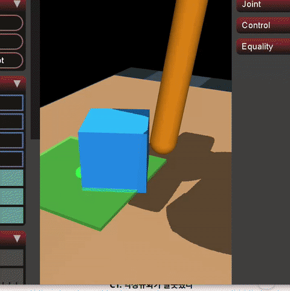
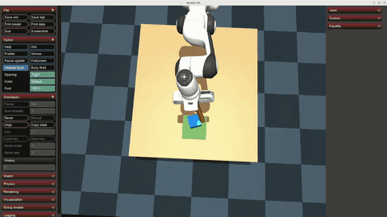

# FR3 block-pushing environment

## Purpose and ownership

This milestone adds a MuJoCo-only planar block-pushing task driven by the
existing OMY-to-FR3 teleoperation controller.

`OMY_FRANKA_TELEOP` remains the source of truth for OMY MuJoCo FK, Cartesian
mapping, cumulative clutch behavior, target conditioning,
velocity-DLS IK, null-space posture, FR3 commands, and FR3 assets. This project
owns the table, block, fixed goal, camera, primitive push tool, reset, task
evaluation, viewer, and final simulation loop. The dependency is one-way:
`dp-act-policy-study` imports the teleop implementation; the teleop repository
does not know about this task.

The runner owns one final FR3/task `MjModel`, one `MjData`, and one `mj_step`
loop. A separate OMY model is used only for leader FK, as in the existing
teleop implementation; it is not stepped as a second simulator.

## Dependency setup

The dependency root is resolved once, in this priority order:

1. `--teleop-root`
2. `OMY_FRANKA_TELEOP_ROOT`
3. sibling `../OMY_FRANKA_TELEOP` (lowercase sibling is also accepted)

The expected dependency contains `launch/FR3_omy_bridge.py`,
`mujoco_menagerie/franka_fr3/fr3.xml`, and the OMY model.
Both Python environments also need `pyzmq` (tested with `27.1.0`).

```bash
export OMY_FRANKA_TELEOP_ROOT=../OMY_FRANKA_TELEOP
```

## Inspect and run

Scene inspection does not require ROS or OMY hardware:

```bash
python projects/fr3_block_push/scripts/inspect_scene.py \
  --teleop-root ../OMY_FRANKA_TELEOP
```

Run the OMY leader and simulation together from the study root:

```bash
./run
```

Pass a serial port as the first argument when it is not `/dev/ttyUSB0`, for
example `./run /dev/ttyUSB1`.

Keyboard controls:

- `R`: deterministic reset
- `V`: toggle free and fixed operator camera views
- `SPACE`: print task status
- `Q` or `ESC`: quit

The runner prints block position/speed, goal error, success hold time, task
state, teleop mode, selected input freshness, and reset count at 5 Hz.

Tests use the standard library and do not require ROS:

```bash
python -m unittest discover -s projects/fr3_block_push/tests -v
```

## Split-process OMY input

The default direct `ros` input backend remains available. Dataset collection on
this machine should use `--input-backend zmq` so ROS 2 Humble stays in Python
3.10 and LeRobot/MuJoCo stay in Python 3.13:

```text
Process A (Python 3.10)
/leader/joint_states -> name reorder/validation -> ZeroMQ PUB
                                      tcp://127.0.0.1:5557
Process B (Python 3.13)
ZeroMQ SUB -> existing OMY FK/mapping/conditioning/IK -> final FR3 task sim
           -> 20 Hz LeRobot recorder
```

Process A imports `rclpy`, `sensor_msgs`, and `pyzmq`, but never MuJoCo,
LeRobot, or the FR3 controller. It accepts exactly one occurrence of each ROS
joint `joint1` through `joint6` plus trigger `rh_r1_joint`, permits unrelated
extra joints, and converts the six arm joints to the MuJoCo/wire names
`Joint1` through `Joint6` in canonical order. Invalid ROS messages are dropped
with a throttled warning.

Process B uses a non-blocking ZeroMQ `SUB` socket with receive high-water mark
1 and `CONFLATE`, then drains all immediately available messages. This prevents
a control-loop backlog and selects the newest valid sequence. In ZMQ mode the
external bridge is parsed controller-only: its ROS imports and `OmyPose` Node
class are excluded, while its original FK helpers, Cartesian mapping, target
conditioning, and DLS IK functions are executed unchanged. Neither `rclpy` nor
`sensor_msgs` is imported in the collector process.

The single-part UTF-8 JSON message has these exact fields:

| Field | Type | Meaning |
| --- | --- | --- |
| `protocol_version` | non-negative integer | Currently `2` |
| `sequence` | non-negative integer | Strictly increasing publisher sequence |
| `source_timestamp_ns` | non-negative integer | ROS `JointState.header.stamp` |
| `sender_monotonic_ns` | non-negative integer | Publisher monotonic clock |
| `joint_names` | six strings | Canonical `Joint1` ... `Joint6` |
| `position` | six finite numbers | OMY joint positions, radians |
| `trigger_position` | finite number | Physical `rh_r1_joint` clutch position, radians |

Malformed JSON, wrong/missing/extra protocol fields, wrong version, missing or
duplicate required joints/trigger, non-6D position, NaN/Inf, and non-increasing
sequences are ignored. Freshness uses local receive monotonic time rather than
trusting sender timestamps. The default stale timeout is `0.2 s`.

Before the first valid state, or while stale, the backend disables new target
updates, zeros target velocities, and holds the last FR3 joint-position target.
The runner suppresses camera/state/action capture while input is stale, so no
dataset frame is added. On the first valid state and after stale recovery, the
existing clutch path anchors OMY at the newly received state and FR3 at its
current command before applying deltas. This prevents accumulated motion and
reconnection target jumps.

Start Process A in a ROS 2 Humble terminal:

```bash
source /opt/ros/humble/setup.bash
source /home/chan/omy_franka_teleop/open_manipulator_omy/install/setup.bash
cd /home/chan/dp-act-policy-study

/usr/bin/python3 projects/fr3_block_push/scripts/publish_omy_joint_state.py \
  --topic /leader/joint_states \
  --endpoint tcp://127.0.0.1:5557
```

Optionally inspect transport health from the Python 3.13 environment:

```bash
python3 projects/fr3_block_push/scripts/inspect_omy_ipc.py \
  --endpoint tcp://127.0.0.1:5557 \
  --stale-timeout 0.2
```

## LeRobot demonstration recording

The collection path keeps responsibilities separate: `TeleopRunner` owns the
single final MuJoCo model/data, the existing OMY controller, camera rendering,
stepping, task evaluation, and reset. `FrameExtractor` converts one synchronized
runner sample into the schema below. `DatasetRecorder` alone owns
`LeRobotDataset.create`, `add_frame`, `save_episode`,
`clear_episode_buffer`, and `finalize`. No LeRobot source file is modified.

### Dataset schema

The dataset FPS is fixed at 20 Hz and the task text is exactly
`Push the block into the goal region.`. LeRobot automatically creates
`timestamp`, `frame_index`, `episode_index`, `index`, and `task_index`.

| Feature | add_frame representation | Meaning |
| --- | --- | --- |
| `observation.images.top` | `(96, 96, 3)` HWC `uint8`, video | Offscreen RGB from `policy_camera_top` |
| `observation.state` | `(7,)` `float32` | Current `qpos` of `fr3_joint1` ... `fr3_joint7`, rad |
| `action` | `(7,)` `float32` | Joint-position reference actually written to the seven FR3 arm actuators, rad |

The state intentionally excludes the gripper, block pose, goal pose, and task
success. Those task-only quantities are used by environment termination logic,
not as policy inputs.

The FR3 Menagerie model defines `fr3_joint1` through `fr3_joint7` as MuJoCo
`<position>` actuators. Runtime validation also checks that each actuator is a
unit-gear joint transmission with fixed positive gain and affine position bias
`-gain`. The external controller computes `backend.hold_q_target`, then
`TeleopBackend.apply_controller` writes it to
`data.ctrl[backend.fr3_actuator_indices]`. The recorder reads that applied
`data.ctrl` slice after the write. It is a desired position in radians, not
torque, velocity, Cartesian pose, or the measured joint state. The gripper
control is not recorded.

### Phase-1 hybrid ACT experiment

The collector also stores `observation.ee_pose` (`qw,qx,qy,qz,x,y,z`) and
`observation.goal_distance` (XY distance in meters). ACT consumes the exact
`observation.state` feature, so `projects/fr3_block_push/scripts/prepare_hybrid_dataset.py`
packs those values into a 15-dimensional state (7 joints + 7 EE-pose values +
XY distance), while keeping the 7-dimensional joint-position action. The
original dataset is unchanged; the converted dataset is
`datasets/data_success_50_v3_hybrid`.

After conversion, start the CUDA training run with `./train_hybrid`. The
defaults are 5,000 steps, batch size 8, chunk size 64, and 32 executed actions
per predicted chunk. Override them with `STEPS`, `BATCH_SIZE`, `CHUNK_SIZE`, or
`N_ACTION_STEPS` when needed.

## ACT/DP experiment status

The first ACT experiment used 50 episodes. The policy repeatedly stopped before
the goal, which indicated insufficient approach-direction and recovery
demonstrations rather than a simulator/actuator failure. The failure analysis
and the resulting data-collection conclusion are documented in
[the original-50 analysis](docs/act_original_50_failure_analysis.md).



The balanced dataset adds 30 right-approach, 30 center-approach, and 30
left-approach episodes to the original 50 (140 episodes total). Under the same
fixed initial condition and 5,000 training steps, the verified comparison is:

| Metric | ACT | Diffusion Policy |
| --- | ---: | ---: |
| Dataset | balanced-140 | balanced-140 |
| Training steps | 5,000 | 5,000 |
| Evaluation episodes | 5 | 5 |
| Success episodes | 5/5 | 1/5 |
| Success rate | 100% | 20% |
| Final goal distance (mean) | 0.0312 m | 0.0778 m |
| Max lateral deviation (mean) | 0.0270 m | 0.0795 m |

### ACT balanced-140 rollout

The following compressed rollout shows the trained ACT policy completing the
block-push task with the balanced 140-episode dataset.



The complete table, checkpoint/config verification, episode metrics, and DP
5k/10k/15k ablation plan are in
[the ACT vs DP 5k comparison](docs/act_vs_dp_5k_comparison.md).

Observation/action alignment is pre-integration: for time `t`, the existing
controller first computes and writes `action_t`; the runner then captures
`image_t`, current `qpos_t`, and the applied `action_t`; only afterward does it
call `mj_step`. Sampling decisions use `data.time`, not wall time, at intervals
of `0.05 s`. LeRobot generates its timestamps from frame index and the declared
20 FPS. A terminal event does not add an off-cadence frame.

`policy_camera_top` is rendered with `mujoco.Renderer` from the final task
`MjModel`/`MjData`; the interactive viewer framebuffer is never captured. A
scene probe returned HWC `uint8` directly. A block moved from world `y=-0.2`
to `y=+0.2` moved from image row 89 to row 38 at 128 px resolution, confirming
the renderer's conventional top-left image orientation. Therefore collection
does not vertically flip the image. MuJoCo returns RGB, so no BGR conversion is
applied. When a saved video is loaded through LeRobot, its default decoder may
present the sample as a channel-first floating tensor; that read-time form does
not change the validated HWC `uint8` recording boundary or feature metadata.

### Collection lifecycle and controls

Run all three collection processes from the study root. The wrapper keeps the
ROS bridge in its Python 3.10 subshell and the collector in the current Python
3.12+ environment:

```bash
./data \
  --dataset-root /home/chan/dp-act-policy-study/datasets/fr3_block_push_run_001 \
  --episodes 30
```

With no arguments, `./data` collects 30 saved episodes into a new timestamped
directory under `datasets/`. Pass a serial port first when needed, for example
`./data /dev/ttyUSB1 --episodes 30`. `FR3_DATA_PYTHON` can select the collector
interpreter if `python3` is not the intended LeRobot environment.

The default local root is `datasets/fr3_block_push`. The command refuses to
start if the selected root already exists; recording never appends to,
overwrites, or uploads an existing dataset. `--repo-id` is metadata only and
defaults to `local/fr3_block_push`. There is no Hub push.

Keys do not conflict with the existing `run_teleop.py` bindings (`R`, SPACE,
and `Q`/ESC retain their meanings):

- `C`: reset fully, then start recording a new episode
- `S`: save the buffered current episode, whether manually stopped or successful
- `D`: discard the current buffer, reset, and immediately start re-recording
- `R`: discard any current buffer, reset to FR3 home, and return to idle
- `V`: toggle the operator viewer between its free camera and the fixed front view
- `SPACE`: print collection and task status
- `Q` or `ESC`: discard any unsaved buffer, finalize the dataset, and quit

An episode starts only after reset completes. On success, timeout, or leaving
the workspace, sampling pauses and the simulation view is held. Nothing is
saved automatically: press `S` to accept or `D` to discard and re-record.
Manual `S` can also accept the current non-terminal episode. Empty episodes are
rejected. Every reset path clears the current LeRobot buffer before another
episode begins, preventing pre-reset and post-reset frames from mixing.

Inspect a completed local dataset with:

```bash
python projects/fr3_block_push/scripts/inspect_recorded_dataset.py \
  /home/chan/dp-act-policy-study/datasets/fr3_block_push_run_001 \
  --repo-id local/fr3_block_push
```

This prints episode/frame counts, FPS, all features, and the first sample's
image/state/action/timestamp/episode/frame shapes and dtypes. It performs no
training or conversion.

## Scene composition

At runtime, `scene_builder.py` parses the external FR3 XML, resolves its mesh
directory, merges the local task elements, and injects the local primitive
tool under the existing `fr3_hand` frame. It then compiles the resulting
in-memory XML once. No FR3 XML or controller implementation is copied, no
absolute local path is committed, and no generated artifact is saved.

This runtime-combined-XML approach is used because an absolute XML include
does not preserve the included FR3 file's relative mesh directory in the
installed MuJoCo version. The builder leaves both source repositories
unchanged.

## Task definition

The fixed table top is at `z=0.20 m`. A `0.30 kg` free-joint block with
`0.035 m` half-size starts at `(0.62, 0.00, 0.235)`. The non-colliding visual
goal is centered at `(0.80, 0.00, 0.202)` with `0.075 m` planar half-size.
The top policy camera is fixed above the workspace. The separate overhead
camera is only an operator viewer preset and is never recorded. Press `V` to
toggle between that preset and the viewer's free camera. A capsule pusher
attached to the FR3 hand ends just above the table in the home configuration.

Reset restores the seven FR3 joints and actuator targets from the external
FR3 `home` keyframe, closes the unused gripper command, restores the block
free-joint pose, zeros all velocities and actuator state, resets task timers,
and calls `mj_forward`. Reset is deterministic by default; seeded small XY
randomization can be enabled in `BlockPushConfig`.

Success requires the whole block (including a margin) to remain inside the
goal while planar speed is at most `0.01 m/s` for `0.5 s`. Leaving the
configured table workspace or reaching the `120 s` episode timeout is failure.
Evaluation reads state only and never changes the control loop.

## References and limitations

The supplied `Push_MuJoCo` files were used only to study general table,
free-block, visual-goal, camera, pusher, reset, and substep ideas. Their README
identifies <https://github.com/JericLew/Push_MuJoCo> and MuJoCo Menagerie
sources but provides no explicit project license. The originals therefore
remain local-only under `references/Push_MuJoCo/` and are ignored by Git.
Production code neither imports nor includes them and contains no Panda
dependency.

This is simulation-only and does not claim real-robot safety. It does not
include ACT or Diffusion Policy training, Hub upload, multi-camera data,
multi-goal tasks, a gripper policy, or dataset resume/append.

ROS 2 Humble's Python 3.10 and LeRobot's Python 3.13 ABI conflict is isolated by
the ZMQ process boundary. A publisher restart resets its sequence counter; the
current strict anti-regression policy then requires restarting the collector as
well. Hardware ROS joint naming/cadence, long-running publisher recovery,
viewer keys during live recording, and real OMY-driven successful
demonstrations have not yet been exercised.

Finally, the action is a high-gain MuJoCo position-servo reference. It can
differ from measured `qpos`, especially during contact, saturation, or fast
motion. Consumers must not reinterpret it as torque, and sim-to-real use would
need a separately verified controller/action interface.
